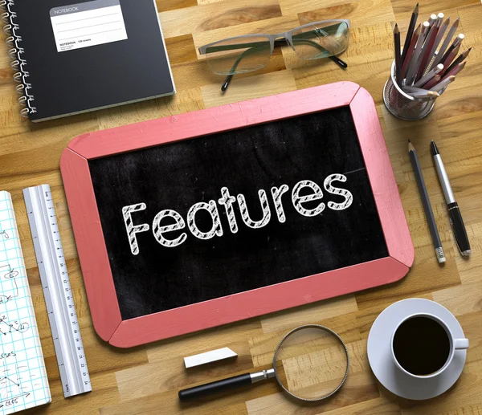

= About Us

'''

We are the team behind **D’OH**, a powerful and intuitive AsciiDoc editor.

== Our Mission

D’OH aims to simplify writing and converting **AsciiDoc** with:

* A seamless **rich text editor** for easy formatting.
* **Live previewing** to see AsciiDoc in real-time.
* A smooth **conversion process** between HTML and AsciiDoc.

== Features

* **Automatic List Handling** (supports ordered and unordered lists)
* **AsciiDoc-to-HTML Conversion** (and vice versa)
* **Live Preview Editing**
* **Image Uploading and Rendering**
* **SSL-secured deployment for safe usage**

== Features to Come!

* **Optinons Between Base64 Blob or Linked Images**
* **Session tokens**
* **Updates to the UI**
* **Better Html to AsciiDoc Conversion**
* **Toggle button to go From Side by Side View to Raw or Rendered view**
* **Toolbar to Work on Rendered Section**

== Contact Us
📧 **Email:** link:mailto:support@takenotation.com[support@takenotation.com]

🌐 **Website:** link:takenotation.com[takenotation]